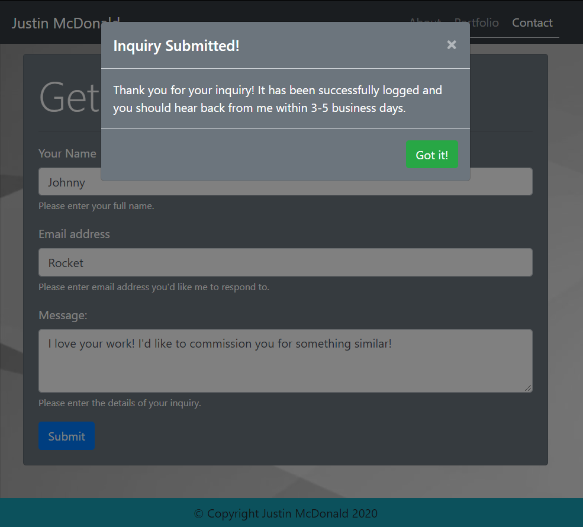

# Responsive Portfolio
> This project is for a responsive UI portfolio website using Bootstrap 4 for the Bootcamp week 2 homework assignment.

Making yourself known in the professional world is not easy. While word of mouth and peer connections are helpful, nothing tells a potential employer more about who you are than a curated portfolio page that's all about you — a page that explains who you are, what you do, and showcases some of your work.

Using a responsive UI generated by Bootstrap, a good portfolio page can be reviewed by anyone at any time, on any device, and give them a pleasant experience in getting to know you. It's a great way to make a solid first impression and hopefully result in them reaching out to hire you for the skills you've portrayed.

## Elements used in this project

This website was built entirely using Bootstrap 4 components, including:

1. Navbar
2. Cards
3. Subcards
4. Card Deck
5. Form
6. Modal
7. Footer 

For the content, I added a brief overview of what I do and why I decided to pursue this course in the About Me area. 

For the portfolio itself, I added a handful of images that highlight a few of the most important aspects of my life and what makes me who I am. 

Finally, I added a contact form for visitors to be able to submit inquiries to me, utilizing a confirmation dialog (modal) to confirm to the user that their inquiry had been received and would be responded to within a specific time frame. 

   - IMPORTANT NOTE: The submit button does not actually submit anything yet.

## Links

Project: https://jmcdonald112358.github.io/Responsive-Portfolio/ 
Repository: https://github.com/jmcdonald112358/Responsive-Portfolio 

### Additional Notes

- A '.gitignore' file is appearing in the repository. I am unsure why this is happening, as I included that filename within the file so that it _wouldn't_ be included. As such, the '.gitignore' file should be ignored until I can get some help on how to prevent it from being included in a push.